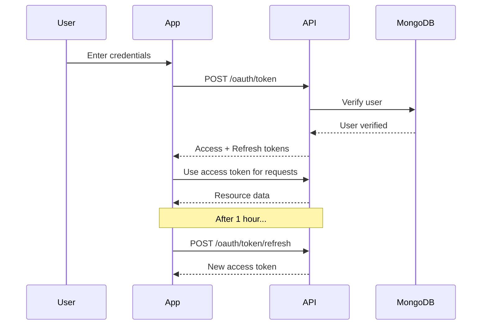

# SDK Authentication

The Lazi SDK uses OAuth2 for secure authentication. This guide covers how to authenticate users and manage access tokens.

## Complete OAuth2 Flow

### Overview

The OAuth2 authentication flow follows these steps:



### Step-by-Step Authentication

1. **Obtain OAuth2 Credentials** from the Lazi developer portal
2. **Get Access Token** by authenticating with username/password or API key
3. **Initialize SDK** with the access token
4. **Automatic Token Refresh** happens behind the scenes

### Full Authentication Example

```python
import requests
import os
from datetime import datetime, timedelta
from lazi_sdk import WriteWidget

class LaziAuthManager:
    """Complete OAuth2 authentication manager"""
    
    def __init__(self, base_url="https://api.lazi.com"):
        self.base_url = base_url
        self.access_token = None
        self.refresh_token = None
        self.token_expires_at = None
    
    def authenticate(self, username: str, password: str, scopes: list):
        """
        Step 1: Get initial access token
        
        Args:
            username: User email or username
            password: User password
            scopes: List of required OAuth2 scopes
        
        Returns:
            dict: Token response with access_token, refresh_token, expires_in
        """
        response = requests.post(
            f"{self.base_url}/oauth/token",
            data={
                "grant_type": "password",
                "username": username,
                "password": password,
                "scope": " ".join(scopes)
            },
            headers={"Content-Type": "application/x-www-form-urlencoded"}
        )
        
        if response.status_code != 200:
            raise Exception(f"Authentication failed: {response.json()}")
        
        tokens = response.json()
        
        # Store tokens
        self.access_token = tokens["access_token"]
        self.refresh_token = tokens["refresh_token"]
        self.token_expires_at = datetime.now() + timedelta(seconds=tokens["expires_in"])
        
        print(f"✅ Authentication successful")
        print(f"   Access token expires in: {tokens['expires_in']} seconds")
        print(f"   Scopes granted: {tokens['scope']}")
        
        return tokens
    
    def refresh_access_token(self):
        """
        Step 2: Refresh expired access token
        
        Returns:
            dict: New token response
        """
        if not self.refresh_token:
            raise Exception("No refresh token available. Please authenticate first.")
        
        response = requests.post(
            f"{self.base_url}/oauth/token/refresh",
            json={"refresh_token": self.refresh_token},
            headers={"Content-Type": "application/json"}
        )
        
        if response.status_code != 200:
            raise Exception(f"Token refresh failed: {response.json()}")
        
        tokens = response.json()
        
        # Update tokens
        self.access_token = tokens["access_token"]
        self.refresh_token = tokens["refresh_token"]
        self.token_expires_at = datetime.now() + timedelta(seconds=tokens["expires_in"])
        
        print(f"✅ Token refreshed successfully")
        
        return tokens
    
    def get_valid_token(self):
        """
        Step 3: Get a valid access token (auto-refresh if needed)
        
        Returns:
            str: Valid access token
        """
        if not self.access_token:
            raise Exception("Not authenticated. Call authenticate() first.")
        
        # Check if token is about to expire (within 5 minutes)
        if datetime.now() >= self.token_expires_at - timedelta(minutes=5):
            print("🔄 Token expiring soon, refreshing...")
            self.refresh_access_token()
        
        return self.access_token
    
    def revoke_token(self):
        """
        Step 4: Revoke access token (logout)
        """
        if not self.access_token:
            return
        
        response = requests.post(
            f"{self.base_url}/oauth/revoke",
            json={"token": self.access_token},
            headers={"Content-Type": "application/json"}
        )
        
        if response.status_code == 200:
            print("✅ Token revoked successfully")
            self.access_token = None
            self.refresh_token = None
            self.token_expires_at = None


# Usage Example
if __name__ == "__main__":
    # Initialize auth manager
    auth = LaziAuthManager()
    
    # Step 1: Authenticate
    tokens = auth.authenticate(
        username="developer@example.com",
        password=os.getenv("LAZI_PASSWORD"),
        scopes=["widgets:write", "widgets:read", "projects:read", "files:write"]
    )
    
    # Step 2: Use access token with SDK
    widget = WriteWidget(
        token=auth.get_valid_token(),
        user_id="user_123"
    )
    
    # Step 3: Token automatically refreshes when needed
    # ... 1 hour later ...
    valid_token = auth.get_valid_token()  # Automatically refreshes
    
    # Step 4: Logout
    auth.revoke_token()
```

## Basic Authentication

### Using Username and Password

```python
from lazi_sdk import WriteWidget

# Initialize with OAuth token
widget = WriteWidget(
    token="your_oauth_access_token",
    user_id="user_12345"
)

# SDK automatically verifies token on first operation
await widget.create_new(name="My Widget", project_id="proj_001")
```

### Getting an Access Token

To obtain an access token, make a request to the OAuth2 token endpoint:

```python
import requests

response = requests.post(
    "https://api.lazi.com/oauth/token",
    data={
        "grant_type": "password",
        "username": "your_username",
        "password": "your_password",
        "scope": "widgets:write widgets:read projects:read"
    }
)

tokens = response.json()
access_token = tokens["access_token"]
refresh_token = tokens["refresh_token"]
```

## Token Management

### Access Token Expiration

Access tokens expire after **1 hour**. The SDK handles token refresh automatically when using the `WriteWidget` or `ReadWidget` classes.

### Refresh Tokens

Refresh tokens are valid for **30 days** and can be used to get new access tokens:

```python
import requests

response = requests.post(
    "https://api.lazi.com/oauth/token/refresh",
    json={"refresh_token": refresh_token}
)

new_tokens = response.json()
new_access_token = new_tokens["access_token"]
```

## OAuth2 Scopes

Request specific scopes based on what operations you need:

### Available Scopes

| Scope | Description |
|-------|-------------|
| `widgets:read` | Read widget data |
| `widgets:write` | Create and modify widgets |
| `widgets:delete` | Delete widgets |
| `widgets:admin` | Full widget administrative access |
| `widgets:execute` | Execute custom widget logic |
| `projects:read` | Read project data |
| `projects:write` | Create and modify projects |
| `projects:delete` | Delete projects |
| `projects:admin` | Full project administrative access |
| `files:read` | Read uploaded files |
| `files:write` | Upload and modify files |
| `files:delete` | Delete files |
| `user:profile:read` | Read user profile |
| `user:profile:write` | Modify user profile |

### Requesting Scopes

```python
response = requests.post(
    "https://api.lazi.com/oauth/token",
    data={
        "grant_type": "password",
        "username": "your_username",
        "password": "your_password",
        "scope": "widgets:write widgets:read files:write projects:read"
    }
)
```

## Authentication Examples

### Example 1: Read-Only Access

```python
from lazi_sdk import ReadWidget

# Initialize with read-only token
reader = ReadWidget(
    username="developer@example.com",
    token="read_only_access_token",
    project_id="project_123"
)

# List all widgets (requires widgets:read scope)
widgets = await reader.list_widgets()
```

### Example 2: Full Widget Management

```python
from lazi_sdk import WriteWidget

# Initialize with write token
writer = WriteWidget(
    token="full_access_token",
    user_id="user_456"
)

# Create widget (requires widgets:write scope)
await writer.create_new(
    name="Analytics Dashboard",
    description="Real-time metrics",
    project_id="project_123"
)

# Attach file (requires widgets:write and files:write scopes)
await writer.attach_media("chart.png", "./local_chart.png")

# Save
await writer.save()
```

### Example 3: API Key Authentication

For server-to-server authentication, use API keys:

```python
import requests

response = requests.post(
    "https://api.lazi.com/oauth/token",
    data={
        "grant_type": "client_credentials",
        "client_id": "your_api_key",
        "client_secret": "your_api_secret",
        "scope": "widgets:write projects:read"
    }
)

api_token = response.json()["access_token"]
```

## Security Best Practices

### 1. Never Hardcode Tokens

```python
# ❌ Bad
token = "sk-1234567890abcdef"

# ✅ Good
import os
token = os.getenv("LAZI_ACCESS_TOKEN")
```

### 2. Use Environment Variables

```python
from dotenv import load_dotenv
import os

load_dotenv()

token = os.getenv("LAZI_ACCESS_TOKEN")
user_id = os.getenv("LAZI_USER_ID")
```

### 3. Handle Token Expiration

```python
from lazi_sdk import WriteWidget
from fastapi import HTTPException

try:
    widget = WriteWidget(token=token, user_id=user_id)
    await widget.create_new(name="Test Widget", project_id="proj_001")
except HTTPException as e:
    if e.status_code == 401:
        # Token expired, refresh it
        new_token = refresh_access_token(refresh_token)
        widget = WriteWidget(token=new_token, user_id=user_id)
```

### 4. Scope Principle of Least Privilege

Only request scopes you actually need:

```python
# ❌ Bad - requesting unnecessary scopes
scopes = "widgets:admin projects:admin files:delete system:admin"

# ✅ Good - only what you need
scopes = "widgets:read projects:read"
```

## Error Handling

```python
from fastapi import HTTPException

try:
    widget = WriteWidget(token=token, user_id=user_id)
    await widget.create_new(name="My Widget", project_id="proj_001")
except HTTPException as e:
    if e.status_code == 401:
        print("Authentication failed: Invalid or expired token")
    elif e.status_code == 403:
        print("Permission denied: Insufficient scopes")
    elif e.status_code == 404:
        print("Resource not found")
    else:
        print(f"Error: {e.detail}")
```

## Next Steps

- [Widget Management](widgets.md) - Learn how to create and manage widgets
- [Examples](examples.md) - See complete authentication examples
- [Advanced Security](../advanced/security.md) - Learn about advanced security features
